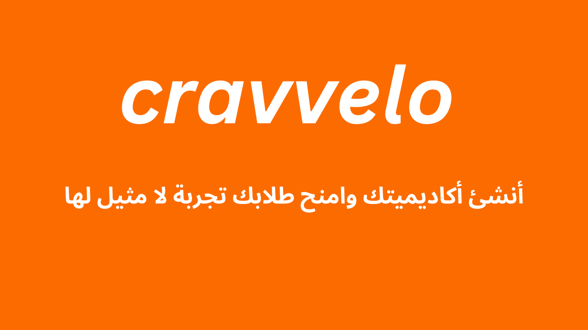

# Project Name

## Description

Cravvelo is a Multi-tenant application which allow users to create their own platform where they can sell their courses and digital products and manage their students all under their costume brad
So they can charge their customers /students even a higher prices and keep all the profit to themselves

## Installation

Describe the installation process for the project. Include any dependencies and how to install them using package managers like npm or yarn.

## Configuration

Detail any configuration options or environment variables required for the project.

## Development

Provide guidelines for setting up the development environment, including coding standards, code formatting, and version control workflows used by the team.

## Troubleshooting

Document common issues and their solutions, along with instructions for debugging and resolving errors.

## Security

Outline security best practices and guidelines for handling sensitive data. Include instructions for reporting security vulnerabilities.

## Documentation

Include links to additional documentation, such as API references or internal documentation resources.

## Release Notes

Document changes, new features, and bug fixes for each release of the project.

## Support

Provide contact information for support within the organization, such as email addresses or Slack channels.

## License

Specify the license under which the project is released. Include any licensing terms or conditions.
