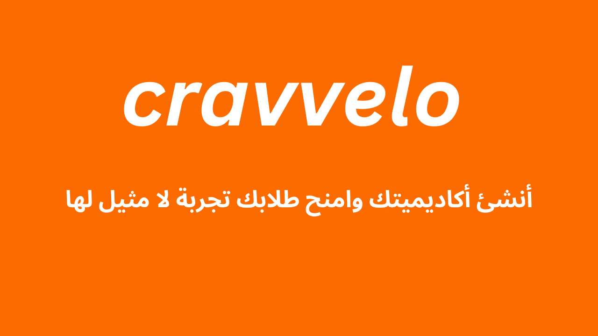

# Cravvelo


[](LICENSE.md)

**Cravvelo** is an all-in-one academy builder that lets you **sell your courses**, **manage students**, **process secure payments**, and **handle homework** — all from a single platform.  
Built with modern web technologies, Cravvelo makes it easy for educators, coaches, and organizations to launch and grow their online academies.

**This project is licensed under the [Cravvelo Non-Commercial License (CNCL)](LICENSE.md). It may not be used for commercial purposes.**

---

## Features

- **Course management** — Create and organize courses, chapters, and video content
- **Student management** — Enroll students, track progress, and manage access
- **Payments** — Integrations with Chargily and P2P payment flows
- **Homework & assignments** — Collect and review student work
- **Certificates** — Generate and store completion certificates (e.g. PDF via microservice + S3)
- **Multi-tenant academies** — Run multiple academies from one deployment

---

## Tech stack

- **Monorepo** — Turborepo with `apps` (cravvelo, dashboard, academia, website) and shared `packages`
- **Frontend** — Next.js, React 19, shadcn/ui
- **Auth** — Clerk
- **Payments** — Chargily, P2P
- **Infrastructure** — Vercel, AWS (S3), Resend (email), Pusher

---

## Installation

### Prerequisites

- **Node.js** v20.19.0 or later (v24.x recommended; see `engines` in root `package.json`)
- **pnpm**, **npm**, or **yarn** installed globally

### Steps

```bash
# 1. Clone the repository
git clone https://github.com/yousribouhamed/Cravvelo.git
cd Cravvelo

# 2. Install dependencies
pnpm install
# or
npm install
# or
yarn install

# 3. Create an environment file
cp .env.example .env
# Fill in the required variables (Clerk, Chargily, Vercel, AWS, Resend, Pusher, etc.). See .env.example for the full list.

# 4. Start the development server
pnpm dev
# or
npm run dev
# or
yarn dev
```

---

## Documentation

- [P2P payment flow](docs/payments/p2p.md)
- [Certificate generation](docs/certificate.md)
- [Full docs index](docs/README.md)

---

## Contributing

We welcome contributions. Please read [CONTRIBUTING.md](CONTRIBUTING.md) for how to report bugs, suggest features, and submit pull requests. By participating, you agree to our [Code of Conduct](CODE_OF_CONDUCT.md).

---

## License

Licensed under the [Cravvelo Non-Commercial License (CNCL)](LICENSE.md). This project may **not** be used commercially. For commercial licensing, contact abdellah.chehri14@gmail.com.
