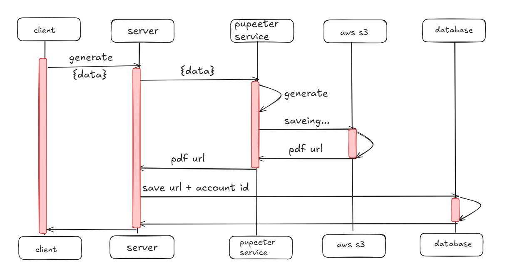

# Certificate Generation Feature

## Overview

This feature allows you to generate certificates in PDF format. The generated PDFs are stored in AWS S3, and the URL of the stored PDF is returned in the response.

## Problem: Puppeteer in Edge on Vercel

### The Issue

When attempting to use Puppeteer on Vercel's Edge environment, we encountered significant limitations and challenges. Vercel's Edge environment is optimized for lightweight operations, and Puppeteer, a headless browser for generating PDFs, is resource-intensive. This caused performance issues, timeouts, and sometimes outright failures in generating certificates.

### The Solution

To overcome this, we shifted the PDF generation process to a microservice deployed on Render. Render's environment is better suited for handling the resource demands of Puppeteer. This approach allowed us to bypass the limitations imposed by Vercel's Edge, ensuring reliable and efficient certificate generation.

## System Architecture



### How It Works

1. **Request to Microservice**: When a certificate needs to be generated, a POST request is sent to the microservice hosted on Render. The request contains the necessary data (e.g., certificate details).

2. **PDF Generation**: The microservice uses Puppeteer to generate the certificate in PDF format.

3. **Storing in AWS S3**: Once the PDF is generated, it is stored in an AWS S3 bucket. The microservice handles the upload process and ensures that the PDF is securely stored.

4. **Response with URL**: After the PDF is uploaded to S3, the URL of the stored PDF is returned in the response. This URL can then be used to access the certificate.

## How to Use

### Sending a Request

To generate a certificate, send a POST request to the microservice endpoint:

**Endpoint:**

```
POST https://cravvelo-puppeteer.onrender.com/scrape
```

**Request Body:**

```json
{
  "certificate": "Certificate details here"
}
```

### Response

The response will contain the URL of the generated PDF:

**Example Response:**

```json
{
  "url": "https://cravvel-bucket.s3.region.amazonaws.com/certificates/1234567890.pdf"
}
```

## Deployment Details

### Microservice on Render

The microservice is deployed on Render, a cloud platform that supports resource-intensive operations like PDF generation with Puppeteer.

### AWS S3 Integration

We use AWS S3 for storing the generated PDFs securely. Each PDF is assigned a unique key, ensuring that every certificate can be accessed individually via a unique URL.

## Conclusion

By offloading the certificate generation process to a dedicated microservice on Render, we've been able to maintain the performance and reliability of our application, even when dealing with resource-heavy operations like PDF generation. This approach also ensures that the generated certificates are easily accessible via AWS S3 URLs.
