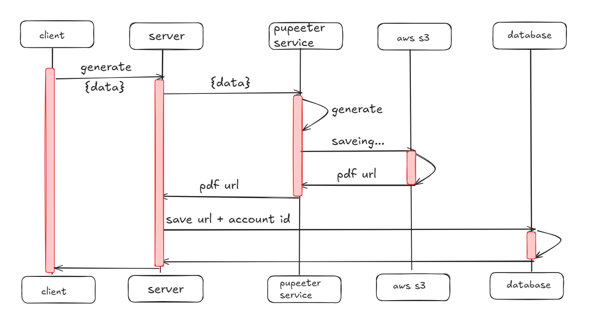

# Certificate Generation Feature

## Overview

This feature allows you to generate certificates in PDF format. The generated PDFs are stored in AWS S3, and the URL of the stored PDF is returned in the response.

### In-app PDF generation (dashboard)

The dashboard app generates certificate PDFs in the TRPC backend using Puppeteer with local headless Chromium (`@sparticuz/chromium`).

This flow does **not** require Browserless token configuration.

## Runtime requirements (Vercel)

1. Use **Node.js runtime** for the TRPC route (`/api/trpc`).
2. Do **not** run certificate generation in Edge runtime.
3. Keep S3 and email configuration available so the generated file can be uploaded and delivered.

## System Architecture

### How It Works

1. **Certificate request**: Dashboard calls `createCertificate` TRPC mutation.
2. **HTML template render**: Server renders selected certificate template to HTML.
3. **PDF generation**: Puppeteer launches local Chromium and prints the first page to PDF.
4. **Storage**: PDF buffer is uploaded to AWS S3.
5. **Delivery + persistence**: Email is sent to the student and the certificate record is saved in DB.

## Deployment Details

We use AWS S3 for storing the generated PDFs securely. Each PDF is assigned a unique key, ensuring that every certificate can be accessed individually via a unique URL.

## Troubleshooting on Vercel

- **Timeouts during certificate creation**
  - Check Vercel function duration limits and logs for `createCertificate`.
  - Confirm external assets in certificate HTML (images/fonts/scripts) are reachable.
- **Blank or partially rendered PDFs**
  - Verify template assets are public and accessible from server runtime.
  - Confirm website stamp URL is valid when included in templates.
- **PDF generation crashes**
  - Ensure deployment is on Node.js runtime (not Edge).
  - Check logs for Chromium launch/render errors emitted by certificate mutation.
- **Upload/email succeeds inconsistently**
  - Validate AWS and Resend env vars in Vercel project settings.

## Conclusion

Certificate generation is handled inside the dashboard backend with local Chromium and remains integrated with existing S3 upload + email delivery flow.
